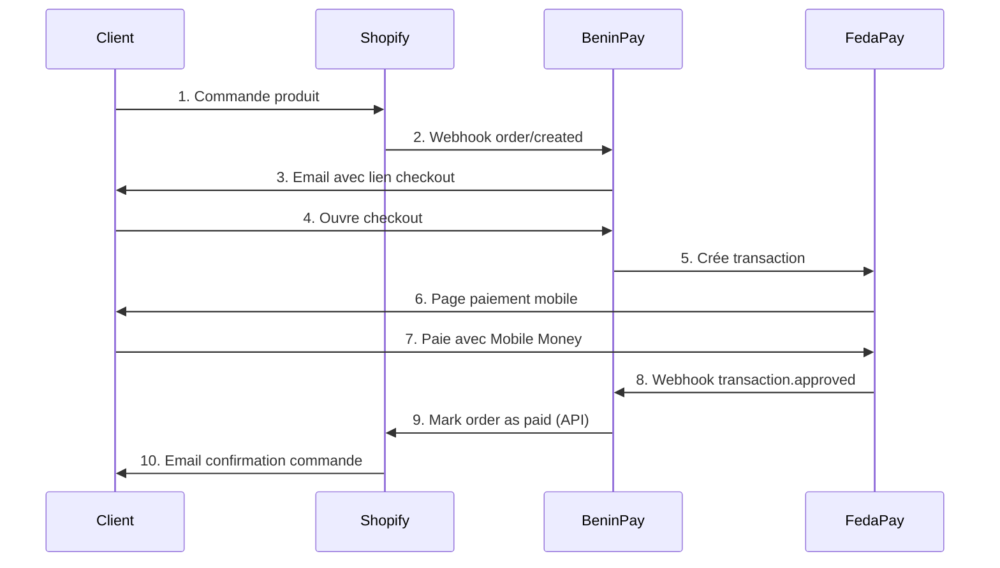

# 🛍️ Installation BeninPay sur Shopify Partners

## ✅ Prérequis
- [x] Serveur BeninPay actif: http://localhost:3000 ✅
- [x] Tunnel actif: `wood-silly-verse-promote.trycloudflare.com` ✅
- [ ] Compte Shopify Partners
- [ ] Boutique de développement

---

## 📋 Étape 1: Créer l'App sur Shopify Partners

### 1.1 Accéder au Dashboard
👉 **URL**: https://partners.shopify.com/

### 1.2 Créer une Nouvelle App
1. **Apps** → **Create app** → **Create app manually**
2. Remplir le formulaire:

```
App name: BeninPay
App URL: https://wood-silly-verse-promote.trycloudflare.com
```

### 1.3 Configuration OAuth (Redirection URLs)

**Important**: Ajouter ces 2 URLs de redirection:

```
https://wood-silly-verse-promote.trycloudflare.com/shopify/callback
https://wood-silly-verse-promote.trycloudflare.com/shopify/auth/callback
```

### 1.4 Scopes API (Permissions)

Cocher les scopes suivants:

**Orders (Commandes)**
- ✅ `read_orders` - Lire les commandes
- ✅ `write_orders` - Modifier les commandes

**Products (Produits)**
- ✅ `read_products` - Lire les produits

**Customers (Clients)**
- ✅ `read_customers` - Lire les clients

**Checkouts**
- ✅ `write_checkouts` - Modifier les checkouts

### 1.5 Configuration App

**App type**: Custom app (Non-embedded)
**Distribution**: Public (pour Shopify App Store plus tard)

### 1.6 Récupérer les Credentials

Après création, copier:
- ✅ **API Key**: `a206457ee47295ab6e2501e861ad7ba1` (déjà dans .env)
- ✅ **API Secret**: `shpss_...` (déjà dans .env)

---

## 📋 Étape 2: Créer une Boutique de Développement

### 2.1 Créer la Boutique
1. **Stores** → **Add store** → **Development store**
2. Remplir:

```
Store name: beninpay-test-store
Store purpose: Test an app or theme
Industry: Retail
```

3. Attendre 30-60 secondes (création automatique)

### 2.2 URL de la Boutique
Votre boutique sera accessible sur:
```
https://beninpay-test-store.myshopify.com
```

**Credentials admin**: Check your email!

---

## 📋 Étape 3: Installer BeninPay sur la Boutique

### 3.1 URL d'Installation

Ouvrir cette URL dans le navigateur (remplacer `STORE_NAME`):

```
https://wood-silly-verse-promote.trycloudflare.com/shopify/auth?shop=beninpay-test-store.myshopify.com
```

**OU via curl pour tester**:
```bash
curl "https://wood-silly-verse-promote.trycloudflare.com/shopify/auth?shop=beninpay-test-store.myshopify.com"
```

### 3.2 Flow OAuth

1. **Page 1**: Connexion Shopify
   - Email: `admin@beninpay-test-store.myshopify.com`
   - Password: (envoyé par email)

2. **Page 2**: Permission Request
   - BeninPay demande accès à:
     - Orders (read/write)
     - Products (read)
     - Customers (read)
     - Checkouts (write)
   - **Cliquer**: "Install app"

3. **Page 3**: Redirection Callback
   - Shopify → `https://.../shopify/callback?code=XXX&shop=...`
   - BeninPay échange le code contre un access token
   - Sauvegarde dans DB: `db/beninpay-data.json`

4. **Page 4**: Dashboard BeninPay
   - Redirection vers: `/merchant-dashboard.html?shop=...`
   - ✅ Installation réussie!

---

## 🧪 Étape 4: Vérifier l'Installation

### 4.1 Check Installation Status
```bash
curl "http://localhost:3000/shopify/verify?shop=beninpay-test-store.myshopify.com"
```

**Résultat attendu**:
```json
{
  "installed": true,
  "shop": "beninpay-test-store.myshopify.com",
  "accessToken": "shpat_...",
  "scopes": ["read_orders", "write_orders", ...]
}
```

### 4.2 Lister les Boutiques Installées
```bash
curl http://localhost:3000/shopify/stores
```

**Résultat attendu**:
```json
{
  "success": true,
  "count": 1,
  "stores": [
    {
      "shop": "beninpay-test-store.myshopify.com",
      "installedAt": "2026-06-19T06:00:00.000Z",
      "plan": "free",
      "status": "active"
    }
  ]
}
```

---

## 📋 Étape 5: Tester le Paiement

### 5.1 Créer une Commande sur Shopify

1. **Admin Shopify**: https://beninpay-test-store.myshopify.com/admin
2. **Orders** → **Create order**
3. Remplir:
   - Customer: Test User (test@example.com)
   - Product: Ajouter un produit
   - Total: 5000 XOF

4. **Save** → Copier l'Order ID (ex: `#1001`)

### 5.2 Générer le Lien de Paiement

**Option A**: Via Dashboard BeninPay
```
https://wood-silly-verse-promote.trycloudflare.com/merchant-dashboard.html?shop=beninpay-test-store.myshopify.com
```
- Aller dans "Créer un paiement"
- Remplir le formulaire
- Copier le lien généré

**Option B**: Checkout Direct
```
https://wood-silly-verse-promote.trycloudflare.com/checkout.html?amount=5000&orderId=1001&shopName=BeninPay%20Test%20Store
```

### 5.3 Effectuer le Paiement

1. Ouvrir le lien checkout
2. Voir les détails:
   - Montant produits: 5000 XOF
   - Frais BeninPay (4%): 200 XOF
   - **Total**: 5200 XOF

3. Cliquer "Payer maintenant"
4. Redirection FedaPay
5. Choisir opérateur (MTN/Moov)
6. Entrer numéro + PIN
7. Confirmation

### 5.4 Vérifier le Webhook

**Logs serveur** (attendre 5-10s):
```
Webhook FedaPay reçu: {
  transaction_id: "txn_xxx",
  status: "approved",
  amount: 5200,
  custom_metadata: { order_id: "1001" }
}
✅ Paiement approuvé - Transaction: txn_xxx, Commande: 1001
```

---

## 🔄 Workflow Complet Shopify



---

## 📊 URLs de Référence

### Développement
| Route | URL |
|-------|-----|
| Server Health | http://localhost:3000/health |
| Tunnel Public | https://wood-silly-verse-promote.trycloudflare.com |
| OAuth Start | `https://.../shopify/auth?shop=STORE.myshopify.com` |
| OAuth Callback | `https://.../shopify/callback` |
| Verify Install | `https://.../shopify/verify?shop=STORE.myshopify.com` |
| List Stores | `https://.../shopify/stores` |
| Merchant Dashboard | `https://.../merchant-dashboard.html?shop=STORE.myshopify.com` |
| Checkout | `https://.../checkout.html?amount=X&orderId=Y&shopName=Z` |

### Shopify Admin
| Page | URL |
|------|-----|
| Partners Dashboard | https://partners.shopify.com/ |
| Dev Store Admin | https://beninpay-test-store.myshopify.com/admin |
| Orders | https://beninpay-test-store.myshopify.com/admin/orders |
| Apps | https://beninpay-test-store.myshopify.com/admin/apps |

### FedaPay
| Page | URL |
|------|-----|
| Dashboard | https://dashboard.fedapay.com/ |
| Transactions | https://dashboard.fedapay.com/transactions |
| API Keys | https://dashboard.fedapay.com/settings/api-keys |
| Webhooks | https://dashboard.fedapay.com/settings/webhooks |

---

## 🔐 Sécurité

### Webhook Shopify (À implémenter)
```javascript
import crypto from 'crypto';

function verifyShopifyWebhook(req) {
  const hmac = req.headers['x-shopify-hmac-sha256'];
  const body = JSON.stringify(req.body);
  
  const hash = crypto
    .createHmac('sha256', process.env.SHOPIFY_API_SECRET)
    .update(body, 'utf8')
    .digest('base64');
  
  return hash === hmac;
}
```

### Webhook FedaPay (À implémenter)
```javascript
function verifyFedaPayWebhook(req) {
  const signature = req.headers['x-fedapay-signature'];
  const body = JSON.stringify(req.body);
  
  const expectedSignature = crypto
    .createHmac('sha256', process.env.FEDAPAY_WEBHOOK_SECRET)
    .update(body)
    .digest('hex');
  
  return signature === expectedSignature;
}
```

---

## 🐛 Troubleshooting

### Problème 1: Tunnel Cloudflare ne répond pas
**Solution**:
```bash
# Redémarrer le tunnel
pkill cloudflared
cloudflared tunnel --url http://localhost:3000
```

### Problème 2: OAuth échoue "redirect_uri mismatch"
**Solution**: Vérifier que l'URL dans Shopify Partners match exactement:
```
https://wood-silly-verse-promote.trycloudflare.com/shopify/callback
```

### Problème 3: Access token invalide
**Solution**: Réinstaller l'app
```bash
# 1. Supprimer de db/beninpay-data.json
# 2. Refaire OAuth: /shopify/auth?shop=...
```

### Problème 4: Webhook FedaPay ne passe pas
**Solution**: Configurer webhook URL sur FedaPay Dashboard:
```
https://wood-silly-verse-promote.trycloudflare.com/api/payment/webhook
```

---

## 🚀 Prochaines Étapes

1. ✅ Serveur actif
2. ✅ Tunnel configuré
3. ⏳ Créer app Shopify Partners
4. ⏳ Créer boutique dev
5. ⏳ Installer BeninPay
6. ⏳ Tester paiement
7. ⏳ Configurer webhooks automatiques
8. ⏳ Déployer en production

---

**Créé avec ❤️ au Bénin 🇧🇯**
